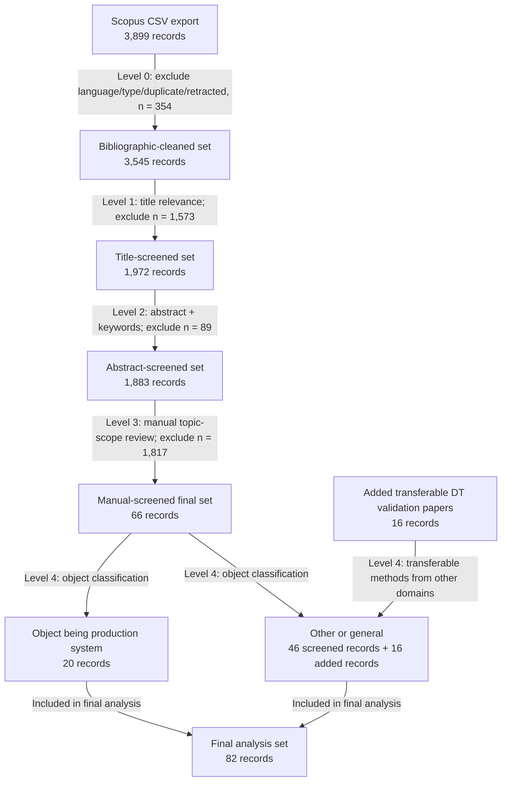

# Screening Report

## Input And Outputs

- Screening-process reference table: [screening_process_reference.csv](screening_process_reference.csv)
- Final screened 66 papers: [final_screened_66_papers.csv](final_screened_66_papers.csv)
- Level 4 added transferable papers only: [level4_added_transferable_papers.csv](level4_added_transferable_papers.csv)

Intermediate working files, including the raw Scopus export and per-level outputs, are kept in [intermediate_results](intermediate_results).

## Script Implementation

The import step uses [scopus_csv_to_screening_table.py](scopus_csv_to_screening_table.py).
It maps `Title`, `Year`, `Authors`, `Source title`, `DOI`, `Link`, `Language of Original Document`, `Document Type`, `Publication Stage`, `Open Access`, `Source`, `EID`, and `Abstract` from the Scopus CSV export into the screening table schema.
The abstract is preserved in the converted table so Level 2 can run directly without a separate abstract-merge step.

Level 0 uses [level0_cleaning.py](level0_cleaning.py).
It performs deterministic bibliographic cleaning on document usability, document type, original document language, retraction status, and duplicates.

Level 1 uses [level1_title_screening.py](level1_title_screening.py).
It performs deterministic title keyword matching for digital-twin/model, validation/update/synchronisation/calibration, and production/manufacturing relevance.
Records that are plausible but not explicit enough at title level are kept as `Uncertain`.

Level 2 uses [level2_abstract_screening.py](level2_abstract_screening.py).
It performs deterministic keyword matching over title, abstract, author keywords, and index keywords.
The rule set keeps records as `Include` or `Uncertain` when the text indicates a digital-twin-like model context, validation/calibration/update/synchronisation evidence, and production/manufacturing relevance.

Level 3 uses [level3_manual_screening_gui.py](level3_manual_screening_gui.py).
It provides a local webpage for manual review of Level 2 `Include` and `Uncertain` records.
The manual decision checks whether the paper is actually about validation on digital twins and whether terms such as validation, calibration, update, alignment, synchronisation, or conformance checking are used within the scope of digital-twin validation.

Level 4 uses [level4_object_classification_app.py](level4_object_classification_app.py).
It classifies the 66 Level 3 retained papers into papers whose object is a production system and papers that are other or general.
Level 4 also records the 16 added transferable-domain digital-twin validation papers separately, without presenting those added papers as part of the Scopus screening process.

## Reference Tables

The main screening reference table is [screening_process_reference.csv](screening_process_reference.csv).
It contains only the Scopus screening process records:

- 3,899 records from the June 15, 2026 Scopus CSV export.
- Level 0, Level 1, Level 2, and Level 3 screening information where each record reached that level.
- No additional transferable-domain papers.
- No old-screened-table rows.

The Level 4 added transferable papers are kept separately in [level4_added_transferable_papers.csv](level4_added_transferable_papers.csv).
That added-paper table is bibliographic only and does not demonstrate a screening process.

Key columns in `screening_process_reference.csv`:

- `in final set?`: `TRUE` for the 66 records retained after Level 3, otherwise `FALSE`.
- `source_collection`: source collection name.
- `level_0_reader`, `level_1_reader`, `level_2_reader`: scripted screening step used for that decision.
- `level_0_decision`, `level_1_decision`, `level_2_decision`: decision at each scripted level.
- `level_3_reader`: manual Level 3 review app when the paper reached manual topic-scope screening.
- `level_3_manual_decision`: manual `IN` or `OUT` decision where available.
- `screening_status`, `filtered_at_level`, `filter_reason`: compact summary of where the record stopped or whether it was retained.
- `retained_after_level_3`: whether the record is one of the 66 papers retained after Level 3.

## Criteria

### Level 0 Bibliographic Cleaning

Include records when they have usable bibliographic identity and are English or language-blank, non-excluded document types, not retracted, and not duplicate records.

Exclude records by:

- `L0-LANGUAGE`: original document language is not English.
- `L0-DOCTYPE`: document type is book, conference review, editorial, erratum, or note.
- `L0-RETRACTED`: document type indicates retracted.
- `L0-DUP`: duplicate DOI, or duplicate normalized title plus year when DOI is absent.
- `L0-NODOC`: no usable title, DOI, or Scopus URL.

### Level 1 Title Screening

Include when the title explicitly combines digital twin/model context, validation/update/calibration/synchronisation evidence, and production/manufacturing relevance.

Keep as `Uncertain` when the title has partial but potentially relevant signals, such as digital twin plus production without explicit validation, or production plus model plus validation without explicit digital twin wording.

Exclude records by:

- `L1-E-NOPROD`: title is outside production/manufacturing scope.
- `L1-E-NODT`: title lacks digital-twin-like or model/simulation context.
- `L1-E-NOVAL`: title lacks validation/update/calibration/synchronisation evidence.

### Level 2 Abstract And Keyword Screening

Include when title, abstract, and keywords contain a digital-twin-like model context, production/manufacturing context, and explicit validation/calibration/update/synchronisation evidence.

Keep as `Uncertain` when the text has enough partial evidence to require manual review, especially where the abstract is missing or the meaning of validation needs interpretation.

Exclude records by:

- `L2-E-NODT`: abstract lacks a digital-twin-like model, simulation model, or real-system-linked model context.
- `L2-E-NOPROD`: abstract is outside production/manufacturing scope.
- `L2-E-NOVAL`: abstract lacks validation/update/calibration/synchronisation evidence.
- `L2-E-TOOGENERAL`: abstract is mainly general review/framework/taxonomy/roadmap content without concrete validation evidence.
- `L2-E-MONITORONLY`: abstract is mainly monitoring, visualization, dashboarding, diagnosis, or decision support without validation/update evidence.
- `L2-E-OPTONLY`: abstract is mainly optimization, scheduling, planning, control, or decision-making without validation/update evidence.

### Level 3 Manual Topic-Scope Screening

Include records when manual title/abstract review confirms that the paper is in scope for validation on digital twins.
This includes papers where validation, calibration, update, alignment, synchronisation, conformance checking, or similar terms refer to checking, maintaining, or improving the correspondence between a digital twin/model and its physical system or operational data.

Exclude records when manual review shows that the paper is outside the target scope, including records where validation is only generic algorithm testing, case-study demonstration, optimization/control evaluation, monitoring, visualization, general review content, or a non-production/non-manufacturing domain without transferable digital-twin validation relevance.

### Level 4 Object Classification And Transferable-Domain Addition

Classify the 66 Level 3 retained papers by the object of the digital twin validation study.
Records are classified as production-system-object papers when the digital twin validation target is a production system.
Records are classified as other or general when they are not production-system-object papers or when the paper discusses a general method.

The additional transferable-domain papers are selected as methodological examples from other domains.
They are included to analyze digital-twin validation methods that may transfer to production-system objects, but they are stored in a separate table and are not shown as having passed through the Scopus screening levels.

## Results

| Stage | Input | Include | Uncertain | Exclude | Passed forward |
|---|---:|---:|---:|---:|---:|
| Initial Scopus CSV conversion | 3,899 | - | - | - | 3,899 |
| Level 0 bibliographic cleaning | 3,899 | 3,545 | - | 354 | 3,545 |
| Level 1 title screening | 3,545 | 241 | 1,731 | 1,573 | 1,972 |
| Level 2 abstract and keyword screening | 1,972 | 445 | 1,438 | 89 | 1,883 |
| Level 3 manual topic-scope screening | 1,883 | 66 | 0 | 1,817 | 66 |
| Level 4 object classification | 66 | 20 production-system object | 46 other/general | - | 66 |
| Level 4 added transferable-domain selection | 16 listed | 16 | 0 | 0 | 82 final records |

### Exclusion Counts

| Level | Criterion | Count |
|---|---|---:|
| Level 0 | `L0-LANGUAGE` | 196 |
| Level 0 | `L0-DOCTYPE` | 139 |
| Level 0 | `L0-DUP` | 17 |
| Level 0 | `L0-RETRACTED` | 2 |
| Level 1 | `L1-E-NOVAL` | 744 |
| Level 1 | `L1-E-NOPROD` | 498 |
| Level 1 | `L1-E-NODT` | 331 |
| Level 2 | `L2-E-NOPROD` | 76 |
| Level 2 | `L2-E-TOOGENERAL` | 4 |
| Level 2 | `L2-E-OPTONLY` | 4 |
| Level 2 | `L2-E-MONITORONLY` | 3 |
| Level 2 | `L2-E-NOVAL` | 2 |
| Level 3 | `L3-E-MANUALSCOPE` | 1,817 |
