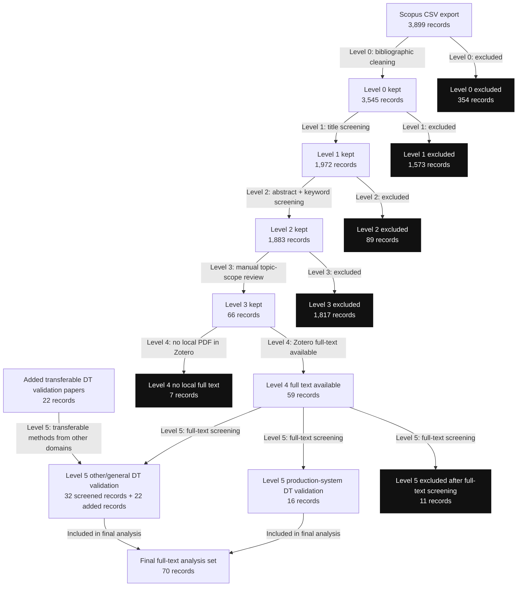

# Screening Report

## Input And Outputs

- Screening-process reference table: [screening_process_reference.csv](level3_manual_screening/screening_process_reference.csv)
- Final post-Level-5 considered Scopus papers: [final_screened_48_papers.csv](level5_full_text_screening/final_screened_48_papers.csv)
- Level 4 full-text availability table: [level4_full_text_availability_66_papers.csv](level4_full_text_availability/level4_full_text_availability_66_papers.csv)
- Level 5 full-text screening table: [level5_full_text_screening_59_papers.csv](level5_full_text_screening/level5_full_text_screening_59_papers.csv)
- Level 5 added transferable papers only: [level5_added_transferable_papers.csv](level5_full_text_screening/level5_added_transferable_papers.csv)
- **Final reviewed validation-method categorisation table:** [level5_validation_method_categorisation.csv](level5_full_text_screening/level5_validation_method_categorisation.csv)

Workflow files are organized by stage in separate folders: [level0_import_cleaning](level0_import_cleaning), [level1_title_screening](level1_title_screening), [level2_abstract_screening](level2_abstract_screening), [level3_manual_screening](level3_manual_screening), [level4_full_text_availability](level4_full_text_availability), and [level5_full_text_screening](level5_full_text_screening).

[level5_full_text_screening/final_screened_48_papers.csv](level5_full_text_screening/final_screened_48_papers.csv) records the post-Level-5 considered Scopus-paper set: 48 papers, with 16 production-system records and 32 other/general records.

The screening levels are described below in process order, from Level 0 through Level 5.

## Screening Levels And Criteria

### Level 0 Bibliographic Cleaning

Include records when they have usable bibliographic identity and are English or language-blank, non-excluded document types, not retracted, and not duplicate records.

Exclude records by:

- `L0-LANGUAGE`: original document language is not English.
- `L0-DOCTYPE`: document type is book, conference review, editorial, erratum, or note.
- `L0-RETRACTED`: document type indicates retracted.
- `L0-DUP`: duplicate DOI, or duplicate normalized title plus year when DOI is absent.
- `L0-NODOC`: no usable title, DOI, or Scopus URL.

### Level 1 Title Screening

Include when the title explicitly combines digital twin/model context, validation/update/calibration/synchronisation evidence, and production/manufacturing relevance.

Keep as `Uncertain` when the title has partial but potentially relevant signals, such as digital twin plus production without explicit validation, or production plus model plus validation without explicit digital twin wording.

Exclude records by:

- `L1-E-NOPROD`: title is outside production/manufacturing scope.
- `L1-E-NODT`: title lacks digital-twin-like or model/simulation context.
- `L1-E-NOVAL`: title lacks validation/update/calibration/synchronisation evidence.

### Level 2 Abstract And Keyword Screening

Include when title, abstract, and keywords contain a digital-twin-like model context, production/manufacturing context, and explicit validation/calibration/update/synchronisation evidence.

Keep as `Uncertain` when the text has enough partial evidence to require manual review, especially where the abstract is missing or the meaning of validation needs interpretation.

Exclude records by:

- `L2-E-NODT`: abstract lacks a digital-twin-like model, simulation model, or real-system-linked model context.
- `L2-E-NOPROD`: abstract is outside production/manufacturing scope.
- `L2-E-NOVAL`: abstract lacks validation/update/calibration/synchronisation evidence.
- `L2-E-TOOGENERAL`: abstract is mainly general review/framework/taxonomy/roadmap content without concrete validation evidence.
- `L2-E-MONITORONLY`: abstract is mainly monitoring, visualization, dashboarding, diagnosis, or decision support without validation/update evidence.
- `L2-E-OPTONLY`: abstract is mainly optimization, scheduling, planning, control, or decision-making without validation/update evidence.

### Level 3 Manual Topic-Scope Screening

Include records when manual title/abstract review confirms that the paper is in scope for validation on digital twins.
This includes papers where validation, calibration, update, alignment, synchronisation, conformance checking, or similar terms refer to checking, maintaining, or improving the correspondence between a digital twin/model and its physical system or operational data.

Exclude records when manual review shows that the paper is outside the target scope, including records where validation is only generic algorithm testing, case-study demonstration, optimization/control evaluation, monitoring, visualization, general review content, or a non-production/non-manufacturing domain without transferable digital-twin validation relevance.

### Level 4 Full-Text Availability

Include records when the corresponding Zotero item in `final_screened_66_papers` has a local PDF attachment.
This defines the set that can be read and classified in detail.

Exclude records from full-text analysis when no local Zotero PDF attachment is found.
These records remain documented in the Level 4 table but do not pass into Level 5 full-text screening.

### Level 5 Full-Text Screening, Object Classification, And Transferable-Domain Addition

Screen the Level 4 full-text papers using the full paper, not only bibliographic metadata or abstract-level evidence.
Records are kept as production-system digital-twin validation papers when the full text confirms that the validation target is a production system.
Records are kept or moved to other/general when the full text shows a general method, a non-production-system validation target, or a paper useful for validation-method discussion but not as a production-system-object paper.
Records are excluded when the full text shows that the paper should not remain in the considered full-text analysis set.

The additional transferable-domain papers are selected as methodological examples from other domains.
The added papers are included to analyze digital-twin validation methods that may transfer to production-system objects, but they are stored in a separate table and are not shown as having passed through the Scopus screening levels.

## Results

| Stage | Input | Include | Uncertain | Exclude | Passed forward |
|---|---:|---:|---:|---:|---:|
| Initial Scopus CSV conversion | 3,899 | - | - | - | 3,899 |
| Level 0 bibliographic cleaning | 3,899 | 3,545 | - | 354 | 3,545 |
| Level 1 title screening | 3,545 | 241 | 1,731 | 1,573 | 1,972 |
| Level 2 abstract and keyword screening | 1,972 | 445 | 1,438 | 89 | 1,883 |
| Level 3 manual topic-scope screening | 1,883 | 66 | 0 | 1,817 | 66 |
| Level 4 full-text availability | 66 | 59 with local Zotero PDF | 0 | 7 without local Zotero PDF | 59 |
| Level 5 full-text screening and classification | 59 | 16 production-system object; 32 other/general | 0 | 11 excluded after full-text screening | 48 |
| Level 5 added transferable-domain selection | 22 listed | 22 | 0 | 0 | 70 final full-text records |

### Exclusion Counts

| Level | Criterion | Count |
|---|---|---:|
| Level 0 | `L0-LANGUAGE` | 196 |
| Level 0 | `L0-DOCTYPE` | 139 |
| Level 0 | `L0-DUP` | 17 |
| Level 0 | `L0-RETRACTED` | 2 |
| Level 1 | `L1-E-NOVAL` | 744 |
| Level 1 | `L1-E-NOPROD` | 498 |
| Level 1 | `L1-E-NODT` | 331 |
| Level 2 | `L2-E-NOPROD` | 76 |
| Level 2 | `L2-E-TOOGENERAL` | 4 |
| Level 2 | `L2-E-OPTONLY` | 4 |
| Level 2 | `L2-E-MONITORONLY` | 3 |
| Level 2 | `L2-E-NOVAL` | 2 |
| Level 3 | `L3-E-MANUALSCOPE` | 1,817 |
| Level 4 | `L4-E-NOFULLTEXT` | 7 |
| Level 5 | `L5-E-FULLTEXTSCREEN` | 5 |

## Full-Text Layer

Level 4 checks whether each of the 66 Level 3 retained Scopus papers has a local PDF attachment in the Zotero collection `final_screened_66_papers`.
The result is recorded in [level4_full_text_availability_66_papers.csv](level4_full_text_availability/level4_full_text_availability_66_papers.csv).
The table keeps compact bibliographic fields, the Zotero item key, the local PDF attachment key where available, and the Level 4 decision.
Papers with `INCLUDE_FULL_TEXT` pass to Level 5 full-text screening.
Papers with `EXCLUDE_NO_FULL_TEXT` are retained as records but are not passed to the Level 5 full-text screening and analysis layer.

Current Level 4 counts are:

| Full-text status | Count |
|---|---:|
| Local PDF available in Zotero | 59 |
| No local PDF found in Zotero | 7 |
| Total Level 3 retained papers | 66 |

The 7 papers without local PDFs in Zotero are:

| Title | First author | Year | Previous object classification |
|---|---|---:|---|
| A Framework for Credible Self-evolution of Equipment Digital Twins | Cheng H. | 2026 | other or general |
| Design and evaluation of an artificial intelligence-based digital twin for industrial manufacturing optimization | Rozyyev A. | 2026 | production system object |
| Verification and Validation of the Numerical and Reduced Models of Roller Bearings | Borim A.L. | 2026 | other or general |
| Building Trust in Digital Twin through Verification and Validation |  | 2023 | other or general |
| Enhancing Digital Twin Accuracy for Energy Efficiency and Decarbonization | White R.J. | 2023 | other or general |
| A Simulation Based Approach to Digital Twin's Interoperability Verification & Validation | Traore M.K. | 2022 | other or general |
| Digital twin for factory system simulation | Vijayakumar K. | 2019 | other or general |

## Level 5 Full-Text Screening

Level 5 is the full-text screening and classification layer for the 59 Scopus papers that passed Level 4.
It is recorded in [level5_full_text_screening_59_papers.csv](level5_full_text_screening/level5_full_text_screening_59_papers.csv).
This layer can keep a paper in the production-system set, keep or move it into the other/general set, or exclude it from the considered full-text analysis set.
The 22 manually added transferable-domain papers are treated as full-text available and are added at Level 5 after the Scopus-paper full-text screening decisions.

Current Level 5 full-text screening counts for the 59 Scopus papers are:

| Level 5 outcome | Count |
|---|---:|
| Kept or moved to production-system digital-twin validation | 16 |
| Kept or moved to other/general digital-twin validation | 32 |
| Excluded after full-text screening | 11 |
| Total Level 4 full-text papers screened | 59 |

The Level 5 full-text screening changes from the earlier production-system set are:

| Action | Title | First author | Year |
|---|---|---|---:|
| Exclude | YZ1.0-MOM: An Integrated Intelligent Management System for Smart Textile Factories Based on Digital Twin and Deep Learning | Su Z. | 2026 |
| Exclude | Validation of Digital Twins in Labor-intensive Manufacturing:Significance and Challenges | Zare A. | 2024 |
| Move to other/general | Development and Validation of Digital Twin Behavioural Model for Virtual Commissioning of Cyber-Physical System | Ruzarovsky R. | 2025 |
| Move to other/general | Automatic Calibration and Update of a Digital Twin for Plug & Produce | Bennulf M. | 2025 |
| Move to other/general | Live fitting of process data within digital twins of manufacturing to use simulation and optimisation | Schumacher C. | 2024 |
| Move to other/general | Methods to Enable Evolvable Digital Twins for Flexible Automated Production Systems | Vogel-Heuser B. | 2024 |
| Move to other/general | Digital twin with augmented state extended Kalman filters for forecasting electric power consumption of industrial production systems | Baldassarre A. | 2024 |

The Level 5 full-text screening changes from the earlier other/general set are:

| Action | Title | First author | Year |
|---|---|---|---:|
| Move to production-system | Online Validation of Simulation-Based Digital Twins Exploiting Time Series Analysis | Lugaresi G. | 2022 |
| Move to production-system | Smart Manufacturing Innovation Through the Integration of Digital Twin and IoT Energy Management | Kwon Y. | 2025 |
| Move to production-system | Preserving Dependencies in Partitioned Digital Twin Models for Enabling Modular Validation | Zare A. | 2025 |
| Move to production-system | Change-point visualization and variation analysis in a simple production line: A process mining application in manufacturing | Chiò E. | 2021 |
| Exclude | Verification and validation of digital twins: a systematic literature review for manufacturing applications | Bitencourt J. | 2025 |
| Exclude | Towards accurate digital twins: A review of calibration methods using event-based and neuromorphic vision | Kombaya Touckia J.V. | 2026 |
| Exclude | Validation of Digital Twins: Challenges and Opportunities | Hua E.Y. | 2022 |

## Validation-Method Classification Package

The reviewed validation-method categorisation table is [level5_validation_method_categorisation.csv](level5_full_text_screening/level5_validation_method_categorisation.csv).
It records 70 full-text records: the 22 added transferable-domain papers and the 48 retained Scopus papers after Level-5 full-text screening.
The five validation-method categories retained for downstream review are:

| Validation-method category | TRUE count |
| --- | ---: |
| Measurement / experiment-based comparison | 48 |
| Calibration / update check | 50 |
| Online / continuous validation | 33 |
| Time series / signal comparison | 26 |
| Simulation / baseline comparison | 21 |
| No assigned validation-method category | 1 |

All rows have now been reviewed against full text.
The remaining outlier with no applicable validation-method category is entry 56, `Incremental update of a digital twin of a production system by using scan and object recognition`.

| Review status | Count |
| --- | ---: |
| Reviewed full text | 70 |
| No assigned validation-method category | 1 |

## Script Implementation

The import step uses [scopus_csv_to_screening_table.py](level0_import_cleaning/scopus_csv_to_screening_table.py).
It maps `Title`, `Year`, `Authors`, `Source title`, `DOI`, `Link`, `Language of Original Document`, `Document Type`, `Publication Stage`, `Open Access`, `Source`, `EID`, and `Abstract` from the Scopus CSV export into the screening table schema.
The abstract is preserved in the converted table so Level 2 can run directly without a separate abstract-merge step.

Level 0 uses [level0_cleaning.py](level0_import_cleaning/level0_cleaning.py).
It performs deterministic bibliographic cleaning on document usability, document type, original document language, retraction status, and duplicates.

Level 1 uses [level1_title_screening.py](level1_title_screening/level1_title_screening.py).
It performs deterministic title keyword matching for digital-twin/model, validation/update/synchronisation/calibration, and production/manufacturing relevance.
Records that are plausible but not explicit enough at title level are kept as `Uncertain`.

Level 2 uses [level2_abstract_screening.py](level2_abstract_screening/level2_abstract_screening.py).
It performs deterministic keyword matching over title, abstract, author keywords, and index keywords.
The rule set keeps records as `Include` or `Uncertain` when the text indicates a digital-twin-like model context, validation/calibration/update/synchronisation evidence, and production/manufacturing relevance.

Level 3 uses [level3_manual_screening_gui.py](level3_manual_screening/level3_manual_screening_gui.py).
It provides a local webpage for manual review of Level 2 `Include` and `Uncertain` records.
The manual decision checks whether the paper is actually about validation on digital twins and whether terms such as validation, calibration, update, alignment, synchronisation, or conformance checking are used within the scope of digital-twin validation.

Level 4 uses [level4_full_text_availability_66_papers.csv](level4_full_text_availability/level4_full_text_availability_66_papers.csv) as the full-text availability record.
This layer separates the bibliographic screening result from the full-text-readable analysis set.
It excludes papers without a local Zotero PDF before detailed classification and validation-method extraction.

Level 5 uses [level5_full_text_screening_59_papers.csv](level5_full_text_screening/level5_full_text_screening_59_papers.csv) as the full-text screening record.
It classifies the Level 4 full-text papers into production-system digital-twin validation, other/general digital-twin validation, or excluded after full-text screening.
[level5_full_text_screening_app.py](level5_full_text_screening/level5_full_text_screening_app.py) is the local review app for maintaining these Level 5 decisions.
Level 5 also records the 22 added transferable-domain digital-twin validation papers separately, without presenting those added papers as part of the Scopus screening process.

## Reference Tables

The main screening reference table is [screening_process_reference.csv](level3_manual_screening/screening_process_reference.csv).
It contains only the Scopus screening process records and remains the 66-paper Level 3 reference before Level 4/5 filtering:

- 3,899 records from the June 15, 2026 Scopus CSV export.
- Level 0, Level 1, Level 2, and Level 3 screening information where each record reached that level.
- No additional transferable-domain papers.
- No old-screened-table rows.

The Level 4 full-text availability table is [level4_full_text_availability_66_papers.csv](level4_full_text_availability/level4_full_text_availability_66_papers.csv).
It records which of the 66 Level 3 retained papers have local Zotero PDFs and therefore pass into the full-text analysis layer.

The Level 5 full-text screening table is [level5_full_text_screening_59_papers.csv](level5_full_text_screening/level5_full_text_screening_59_papers.csv).
It records the production-system, other/general, and exclude outcomes after reading the available full text.

The Level 5 added transferable papers are kept separately in [level5_added_transferable_papers.csv](level5_full_text_screening/level5_added_transferable_papers.csv).
That added-paper table is bibliographic only and does not demonstrate a screening process.
The added transferable papers are treated as full-text available for Level 5 because they were manually selected for detailed analysis.
The added-paper table currently contains 22 records: the original 15 transferable-domain papers, six additional papers carried over from the 39+2 validation-method table, and the generic Meyer simulation-validation reference restored from Table 2.

Key columns in `screening_process_reference.csv`:

- `in final set?`: `TRUE` for the 66 records retained after Level 3, otherwise `FALSE`.
- `source_collection`: source collection name.
- `level_0_reader`, `level_1_reader`, `level_2_reader`: scripted screening step used for that decision.
- `level_0_decision`, `level_1_decision`, `level_2_decision`: decision at each scripted level.
- `level_3_reader`: manual Level 3 review app when the paper reached manual topic-scope screening.
- `level_3_manual_decision`: manual `IN` or `OUT` decision where available.
- `screening_status`, `filtered_at_level`, `filter_reason`: compact summary of where the record stopped or whether it was retained.
- `retained_after_level_3`: whether the record is one of the 66 papers retained after Level 3.

Key columns in `level4_full_text_availability_66_papers.csv`:

- `level4_full_text_decision`: `INCLUDE_FULL_TEXT` or `EXCLUDE_NO_FULL_TEXT`.
- `has_local_pdf`: whether Zotero had a local PDF attachment at the time of checking.
- `title`, `first_author`, `year`: compact bibliographic identity.
- `previous_object_classification`: the earlier object-classification value, kept as provenance only.
- `zotero_item_key`, `pdf_attachment_key`, `pdf_path`: Zotero linkage for later full-text checks.

Key columns in `level5_full_text_screening_59_papers.csv`:

- `level5_full_text_screening_decision`: `PRODUCTION_SYSTEM`, `OTHER_GENERAL`, or `EXCLUDE_AFTER_FULL_TEXT_SCREENING`.
- `level5_final_classification`: `production system object`, `other or general`, or `excluded`.
- `level5_action`: compact provenance describing whether the paper was kept, moved, or excluded.
- `previous_object_classification`: the earlier classification before Level 5 full-text screening.
- `level5_note`: note documenting the full-text screening action.
